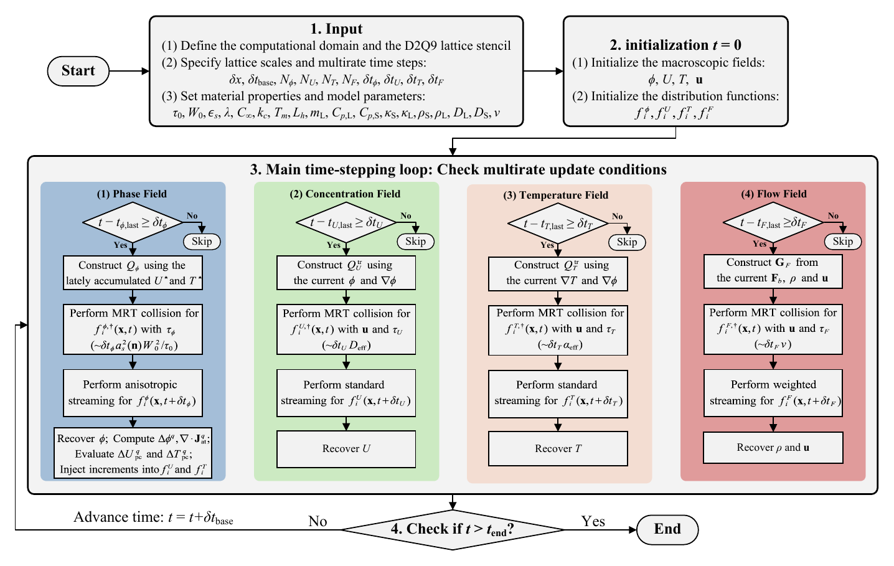
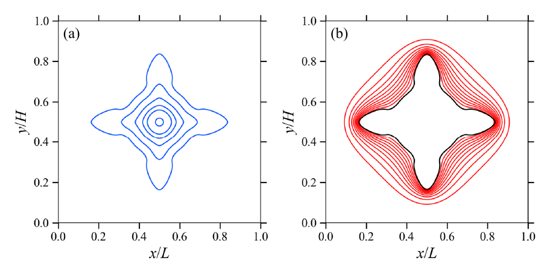
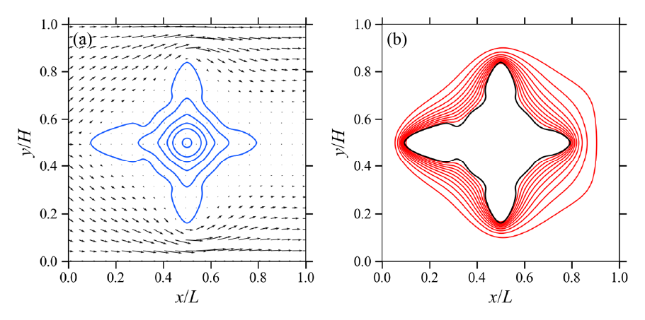
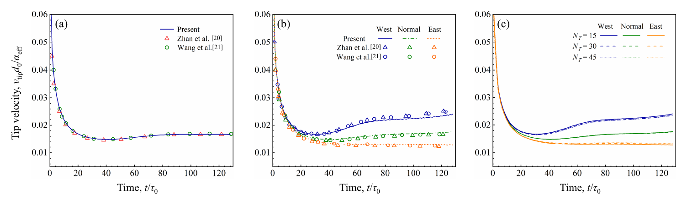
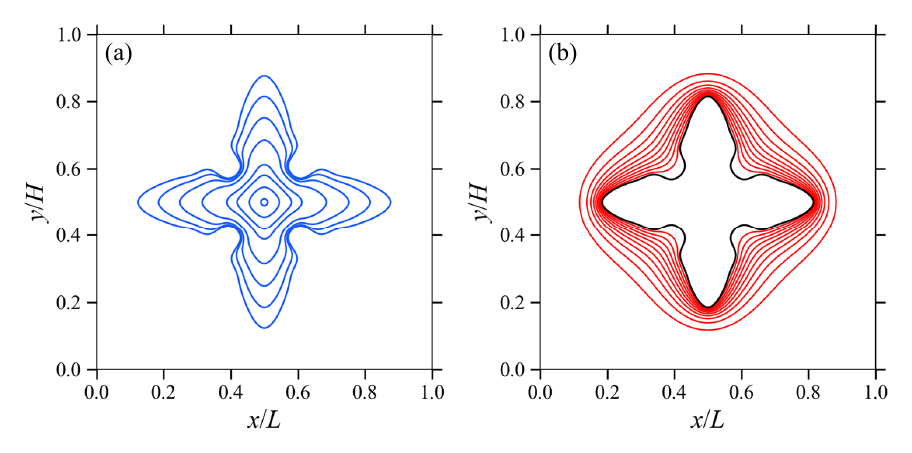
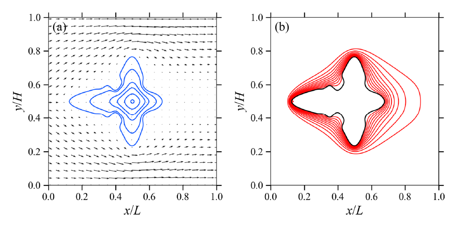
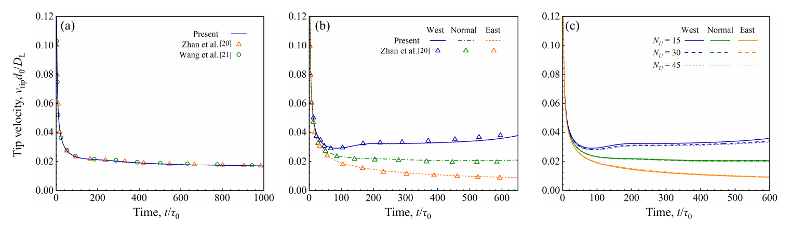
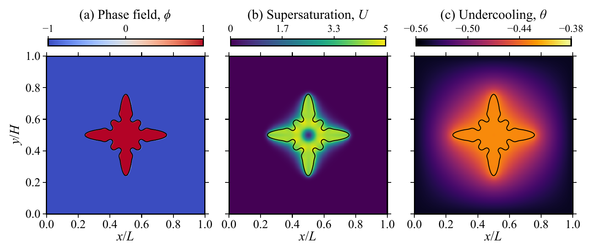
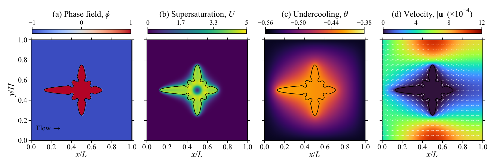
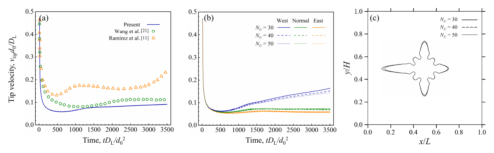

# Manuscript figures 1–10

These PDFs are unchanged copies of the author-supplied manuscript figures. PNG previews are derived from page 1 for browser display, with only surrounding white margins removed. They are reference results, not figures regenerated by the release smoke tests.

| Figure | Topic | Paper section | Original PDF |
|---|---|---|---|
| 1 | Computational workflow of the four-field multirate MRT-LBM | 3.3 | [PDF](figure-01.pdf) |
| 2 | Thermal dendrite under pure diffusion | 4.1 | [PDF](figure-02.pdf) |
| 3 | Thermal dendrite under forced convection | 4.1 | [PDF](figure-03.pdf) |
| 4 | Thermal tip velocities and temperature update-factor comparison | 4.1 | [PDF](figure-04.pdf) |
| 5 | Solutal dendrite under pure diffusion | 4.2 | [PDF](figure-05.pdf) |
| 6 | Solutal dendrite under forced convection | 4.2 | [PDF](figure-06.pdf) |
| 7 | Solutal tip velocities and concentration update-factor comparison | 4.2 | [PDF](figure-07.pdf) |
| 8 | Thermosolutal fields under pure diffusion at Le=50 | 4.3 | [PDF](figure-08.pdf) |
| 9 | Thermosolutal fields under forced convection at Le=50 | 4.3 | [PDF](figure-09.pdf) |
| 10 | Thermosolutal tip velocities and interface contours for N_U=30,40,50 | 4.3 | [PDF](figure-10.pdf) |

## Gallery

### Figure 1. Computational workflow of the four-field multirate MRT-LBM

[Original PDF](figure-01.pdf)

### Figure 2. Thermal dendrite under pure diffusion

[Original PDF](figure-02.pdf)

### Figure 3. Thermal dendrite under forced convection

[Original PDF](figure-03.pdf)

### Figure 4. Thermal tip velocities and temperature update-factor comparison

[Original PDF](figure-04.pdf)

### Figure 5. Solutal dendrite under pure diffusion

[Original PDF](figure-05.pdf)

### Figure 6. Solutal dendrite under forced convection

[Original PDF](figure-06.pdf)

### Figure 7. Solutal tip velocities and concentration update-factor comparison

[Original PDF](figure-07.pdf)

### Figure 8. Thermosolutal fields under pure diffusion at Le=50

[Original PDF](figure-08.pdf)

### Figure 9. Thermosolutal fields under forced convection at Le=50

[Original PDF](figure-09.pdf)

### Figure 10. Thermosolutal tip velocities and interface contours for N_U=30,40,50

[Original PDF](figure-10.pdf)

## Attribution and reuse

The original manuscript figure annotations are retained. Figures 4, 7 and 10 compare the present results with literature data credited within the figures and manuscript. Those third-party datasets and publications are not relicensed by this repository's MIT code license. The manuscript attributes comparisons to Zhan et al. (2023), Wang et al. (2021), and Ramirez et al. (2004).

These PDFs are included as author-supplied reference figures. No independent figure license or underlying full field histories were supplied. The source filenames, SHA-256 hashes and exact LaTeX captions are recorded in [manifest.json](manifest.json). Figures 11–12 and backup variants are deliberately excluded.
